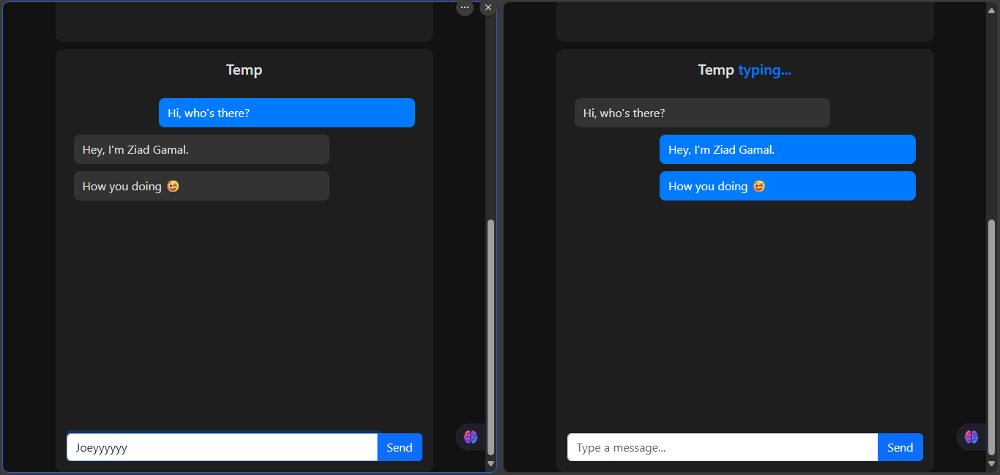
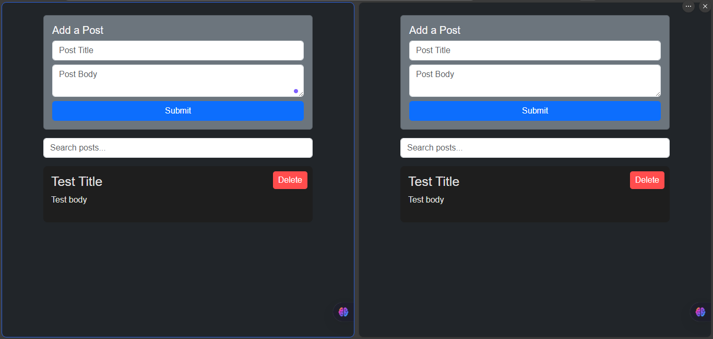

# Real-Time Chat & Posts with Node.js

A simple practice project built during my time at the [Information Technology Institute (ITI)](https://iti.gov.eg/) to explore real-time capabilities in Node.js using **Socket.IO** and basic RESTful APIs.

---

## Overview

This project includes:

- **Post CRUD with real-time sync** across tabs using Socket.IO
- **Simple public chat system** with typing indicator
- Clean separation between **client** and **server**
- MongoDB for data persistence

---

## 📁 Folder Structure

```
📁 client/
  └── posts/      // Real-time posts CRUD UI
  └── chat/       // Simple public chat

📁 server/
  └── src/        // Express + Socket.IO logic
  └── .env        // Mongo URI, Port
  └── server.js   // Main entry

📁 .notes/         // Personal learning notes
```

---

## Technologies Used

- **Node.js**
- **Express.js**
- **Socket.IO**
- **MongoDB + Mongoose**
- **Cron (Node-cron)**
- **HTML / CSS / Vanilla JS**

---

## How to Run It Locally

### 1. Run the Backend

```bash
cd server
npm install
npm start
```

Make sure to create a `.env` file with your MongoDB connection:
```env
PORT=3000
MONGO_URI=mongodb://localhost:27017/iti-sockets
```

### 2. Open the Client

Open these files in your browser (e.g. via Live Server):

- [http://127.0.0.1:5500/client/posts/index.html](http://127.0.0.1:5500/client/posts/index.html)
- [http://127.0.0.1:5500/client/chat/index.html](http://127.0.0.1:5500/client/chat/index.html)

> No changes to the structure needed for deployment with GitHub Pages. You can simply move `client/` content to a separate repo and deploy from there.

---

## 📸 Preview

| Chat | Posts |
|------|-------|
| [](public/screenshots/simple-chat-messaging.png) | [](public/screenshots/simple-post-crud.png) |
| Typing indicator & live messages | Realtime delete/edit across tabs |

---

## Notes

- This project was developed as part of my backend training at **ITI**, focused on learning real-time systems and socket communication using native tools.
- This is a practice project — not intended for production — but a strong base for more advanced WebSocket features like private rooms and authenticated messaging.
